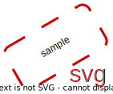
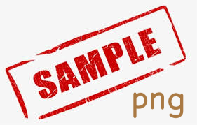

# section

## sous-section

* une liste
* avec des bullets

1. une liste
1. ordonnée avec des
1. numéros

## les fontes

* le **gras**,
* l'*italique*,
* le ***gras italique***,
* on peut ~~même barrer~~ des morceaux

mais surtout pour nous du code `l = string.lower()` comme ceci lorsqu'il est *inline*, ou dans un **bloc** (avec des sauts de ligne) séparé comme cela:

```python
# avec le nom du langage on a des couleurs
# qui mettent en évidence la syntaxe de ce langage
def foo():
    print("Hello World")
```

***

## équations

on peut aussi écrire des maths en $\LaTeX$, soit *inline* comme ceci $\forall x\in\mathbb{R}$, ou encore dans un bloc comme cela:

$$
\forall x \in \mathbb{R}, \forall \epsilon \in \mathbb{R}^+, \exists\alpha\in\mathbb{R}^+ \\
 |x'-x| < \alpha\implies |f(x')-f(x)| < \epsilon
$$

## images

pensez à utiliser l'extension vs-code 'Draw.io Integration' pour produire vos images

### format svg (vectoriel)

préférez un format vectoriel pour les images, comme le svg



### format png (bitmap)



### format jpeg (bitmap)


## tables

ça n'est pas forcément supporté dans toutes les variantes de markdown, mais on peut aussi créer des tables simples

| Nom | Prénom | email |
|-:|:-:|:-|
|Dupont|Jean-Daniel|`jean.dupont@example.com`|
|John|Doe|`jd@foo.com`|

## divers

ligne horizontale

---

ou aussi

***

## MyST

il existe aussi une extension de Markdown qui s'appelle MyST, qui permet de faire encore plus de choses, comme des admonitions, des citations, des notes de bas de page, etc.

méfiez-vous quand même car tout le monde ne supporte pas MyST, donc il vaut mieux rester sur du Markdown de base si vous n'êtes pas sûr

````{admonition} une admonition
:class: tip

voici par exemple une "admonition", dans laquelle j'insère une image en MyST; comme vous voyez, c'est un peu plus verbeux, mais ça permet de faire des choses plus complexes

```{image} sample.drawio.svg
:width: 50px
```
````
